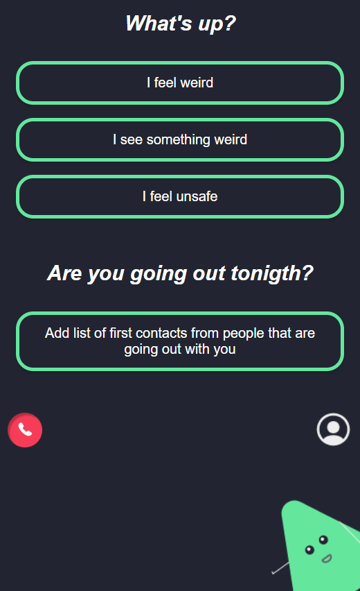
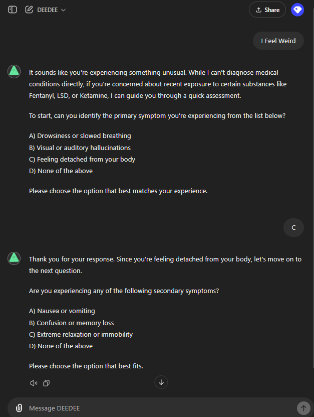
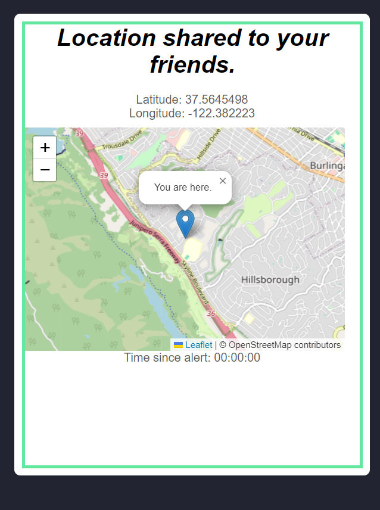

# 🚨 Don't Die AI 🚨

**Your Personal Safety Companion.** When life throws unexpected situations your way, **Don't Die AI** is there to diagnose, assist, and alert the right people—all while keeping you safe.

> 💡 *"When things go weird or unsafe, we’ll make sure you don’t face it alone."*

---

## ✨ Project Background

This project was built during the **Minerva Hackathon 2024**, where the theme focused on tackling **common problems in the Bay Area**. Our team decided to address one of the most pressing issues: **drug abuse and overdose prevention**.

With thousands of overdose cases happening every year, especially in urban areas like San Francisco, we wanted to create a solution that could help people in distress, diagnose potential emergencies, and get help to them quickly. **Don't Die AI** was born out of this need—combining **real-time diagnostics**, **location sharing**, and **automatic emergency contact** to provide a powerful safety net for anyone in danger.

---

## 🎯 Key Features

### 😷 **I Feel Weird**
Not feeling well? Just hit the **"I Feel Weird"** button, and our chatbot will diagnose your symptoms through a series of 5-7 questions. Based on the diagnosis, we either:
- Give advice to keep you safe
- Alert your selected friends with your **location** if things look dangerous

💡 *If you stop typing, a pop-up will ask if you're okay. No response? We alert your friends or emergency services right away.*

### 👀 **I See Something Weird**
Spotted something off? Tap **"I See Something Weird"** and describe what you see. Our chatbot will figure out if it’s dangerous and:
- Ping your friends if it is
- Provide guidance on what to do next

### 🚨 **I Feel Unsafe**
For those moments when things are discreet but not right. This feature is tailored for **preventing sexual assault (SA)** and activates your camera + audio, sharing them live with your trusted friends.

If they don’t respond, we’ll contact **911** and share your location.

### 🌍 **Location Sharing**
Your location is always shared with your selected contacts, and it pops up if you’re in a dangerous situation. Whether it’s through the "I Feel Weird" or "I Feel Unsafe" modes, we make sure your friends know where to find you. 

---

## 📸 **Screenshots**

> 

> 

> 

---

## 🛠️ **How It Works**

1. **Register** and select your **trusted contacts**.
2. In any weird or unsafe situation, tap the relevant button:
   - *"I Feel Weird"* → Start a diagnostic chat
   - *"I See Something Weird"* → Tell us what you see
   - *"I Feel Unsafe"* → Discreetly alert friends, activate your camera, and prepare to call 911
3. **Location Sharing**: Automatically send your location to friends if you're in danger.
4. If no friends respond, **911** is contacted automatically!

---

## 💻 **Project Structure**

```bash
.
.
├── assets
│   ├── css            # All the styles for various pages
│   ├── js             # JavaScript files for interactivity
│   └── images         # Icons, buttons, and images used throughout the app
├── dashboard.html      # Main user dashboard with options to trigger actions
├── friends_overview.html  # Overview of all friends, showing status and location
├── friend_profile.html   # Individual friend's profile with details and status
├── incident_report.html  # Page to report incidents or emergencies
├── main_landing.html     # Main landing page for the app
├── signup_form.html      # Signup form for new users to register
├── symptoms_report.html  # Report symptoms to the chatbot for diagnosis
└── user_profile.html     # User's profile page with settings and details
```

---

## 📱 **Set Up on Your Phone**

1. **Host the Project Locally**:
   - First, you’ll need to host the project so your phone can access it. You can do this using a local server. Here are two simple options:
   
   **Option 1: Using Python's Simple HTTP Server**:
   - Open a terminal or command prompt in the root of your project folder and run the following command:
     ```bash
     # For Python 3.x:
     python -m http.server
     ```
   - This will start a server at `http://localhost:8000`.

   **Option 2: Using Live Server in VS Code**:
   - Install the **Live Server** extension in Visual Studio Code.
   - Open the project folder in VS Code, right-click on the `index.html` or `main_landing.html`, and choose **Open with Live Server**.
   - This will also give you a local URL (e.g., `http://127.0.0.1:5500`).

2. **Find Your Local IP Address**:
   - To access the app from your phone, you need your computer's local IP address. Run this command to get it:
     ```bash
     # For macOS/Linux
     ifconfig

     # For Windows
     ipconfig
     ```
   - Look for the IP address under your network connection (something like `192.168.x.x`).

3. **Access the App on Your Phone**:
   - Make sure both your phone and computer are on the same Wi-Fi network.
   - Open a browser on your phone and type the following into the address bar:
     ```text
     http://<your-local-IP-address>:8000
     ```
   - For example: `http://192.168.0.101:8000` or whatever your local IP address is.

4. **Save it as a Web App** (Optional):
   - If you'd like to access the app like a native mobile app, you can add it to your home screen.
   - In your phone browser (Safari or Chrome), tap the options menu and choose **Add to Home Screen**. This will save the app as an icon, so you can launch it directly from your home screen like an app.

5. **You're all set!**  
   Now you can explore the full functionality of **Don't Die AI** right from your phone.

